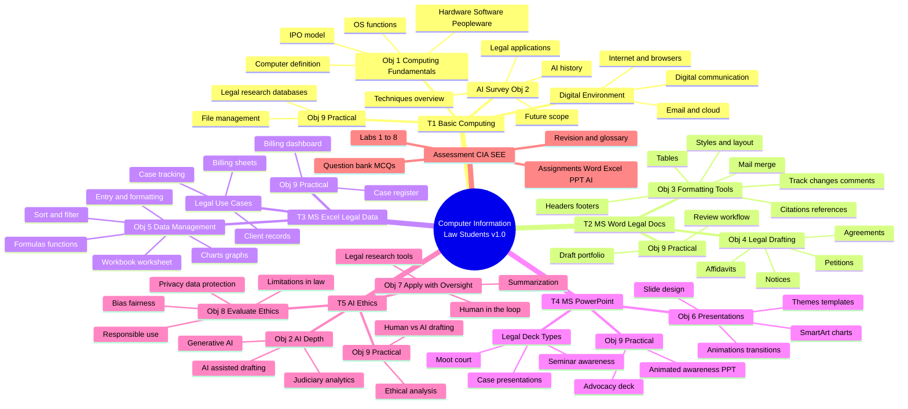

# Computer Information — Course Mind Map (v1.0)

**Subject:** Computer Information | **Audience:** Law students  
**Coverage:** Units T1–T5 | **Objectives:** Obj 1–9

---

## Mermaid Mind Map

---

## Objective Cross-Reference

| Objective | Mind map branch |
|-----------|-----------------|
| Obj 1 | T1 — Computing fundamentals |
| Obj 2 | T1 AI survey; T5 AI depth |
| Obj 3 | T2 — Word formatting |
| Obj 4 | T2 — Legal drafting |
| Obj 5 | T3 — Excel legal data |
| Obj 6 | T4 — PowerPoint |
| Obj 7 | T5 — AI tools with oversight |
| Obj 8 | T5 — AI ethics evaluation |
| Obj 9 | Practical skills across all units |

---

*End of mind map — v1.0*
