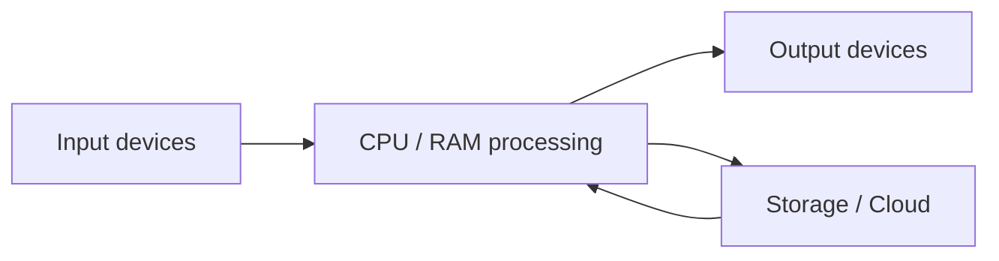
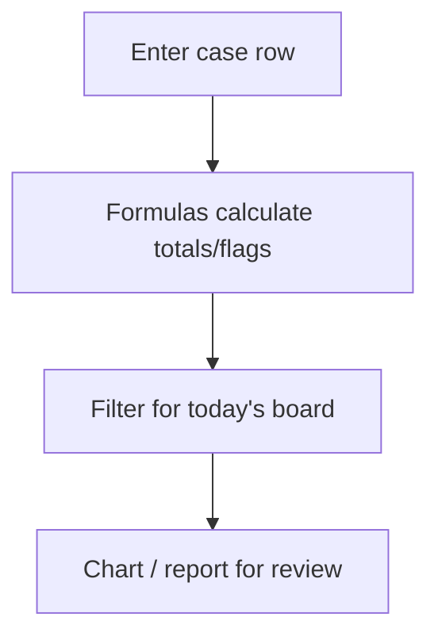
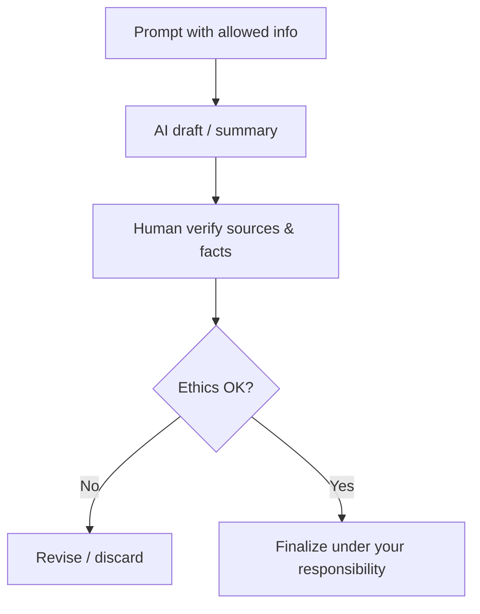

# Computer Information — Student Notes (Full Syllabus)

## How to use these notes
- Study **one unit (T1–T5) at a time**, then complete the matching lab.
- Symbols: **Exam tip** = high-yield for SEE/CIA · **Pitfall** = common mistake.
- After each unit, attempt Self-check items, then the revision sheet drills.

## Learning objectives
1. **[Understand]** Explain computers, OS, internet, and digital communication in legal work.  
2. **[Understand]** Summarize AI history, techniques (conceptual), legal applications, and future scope.  
3. **[Apply]** Format professional legal documents in MS Word (layout, tables, mail merge, citations, track changes).  
4. **[Apply]** Draft notices, agreements, petitions, and affidavits in MS Word.  
5. **[Apply]** Manage legal data in MS Excel (formulas, filters, charts, case/client/billing sheets).  
6. **[Create]** Design moot/seminar/case presentations in MS PowerPoint.  
7. **[Apply]** Use AI tools for research/summarization/assisted drafting with oversight.  
8. **[Evaluate]** Critique AI use for ethics, privacy, bias, and professional limits.  
9. **[Apply]** Complete syllabus practical skills across the toolset.

## Prerequisites
Basic familiarity with using a computer (keyboard/mouse, opening apps, saving files).

## Quick exam orientation
Expect: definitions & short notes (Unit 1, 5), step/procedure questions (Word/Excel/PPT), scenario ethics questions, and **practical tasks** mirroring labs (draft a notice, build a case sheet, present 5–8 slides, critique an AI draft).

---

## T1 — Introduction to Basic Computing
**Objectives:** 1, 2, 9

### Core ideas
A **computer** is an electronic device that accepts data, processes it under instructions, stores results, and produces information. Lawyers use computers daily for drafting, research, communication, evidence organization, and court presentation.

### Key definitions
- **Hardware** — physical parts (CPU, memory, storage, monitor, keyboard).
- **Software** — instructions (system software like OS; application software like Word).
- **Operating System (OS)** — manages hardware/resources and provides a platform for apps (Windows, macOS, Linux).
- **Internet** — global network enabling web access, email, cloud services, online legal databases.
- **Digital communication** — email, messaging, video conference, shared drives—used professionally and securely.
- **Artificial Intelligence (AI)** — systems that perform tasks that typically require human intelligence (pattern recognition, language, recommendation).

### Explanation

#### Components of a computer system
Typical model: **Input → Process → Output → Storage**, plus communication devices.

| Part | Examples | Legal-work use |
|---|---|---|
| Input | Keyboard, scanner | Typing petitions; scanning annexures |
| Process | CPU, RAM | Running Word/Excel/research tools |
| Output | Monitor, printer | Reviewing drafts; printing filings |
| Storage | SSD/HDD, cloud, USB | Case files, backups |
| Software | OS + apps | Entire digital workflow |

#### Operating systems
The OS boots the machine, manages files/folders, security accounts, and device drivers. For legal practice, learn: folder discipline (Client/Case/Year), file naming (`2026_Smith_v_Jones_Notice_v3.docx`), and permissions/sharing carefully.

#### Internet basics & digital communication
- **Browser + search** for open web; **online legal databases** for authentic primary materials.
- **Email** remains formal professional communication—clear subject lines, attachments labeled, confidentiality respected.
- Prefer institution/chambers-approved cloud tools; avoid sending sensitive matter on personal public channels.

#### AI — survey for Unit 1 (ethics deepened in T5)
- **History (very brief):** symbolic AI → machine learning → deep learning → generative AI tools widely available to professionals and students.
- **Applications in law:** research assistance, summarization, document review support, analytics dashboards, drafting assistance (always supervised).
- **Techniques (conceptual only):** rules/expert systems, machine learning from examples, NLP for text, generative models for new text.
- **Future scope:** more embedded legal tech—but regulation, ethics, and professional responsibility grow with capability.

### Worked example
**Scenario:** You must find a recent judgment summary and save it into a client research folder.  
**Workflow:** OS file manager → create `Research/Judgments/2026/` → browser → authenticated database → download PDF → rename clearly → note source in a research log (spreadsheet or note).

### Exam tip
Be ready to **define computer**, list **four component categories**, state **two OS functions**, and write a short note on **AI applications in the legal profession**.

### Common pitfalls
- Myth: “Software is only MS Office.” → Correction: OS is software too; browsers and research tools are applications.
- Myth: “AI always gives correct case law.” → Correction: AI can **hallucinate** citations; verify everything.

### Key takeaways
- Computers transform data to information via IPO + storage.
- OS + disciplined files = professional reliability.
- Internet/email are core legal communication channels—use them securely.
- AI is already part of legal tech; Unit 5 makes ethics non-negotiable.

### Self-check
1. **[Remember]** List four hardware components used in drafting and printing a petition.  
2. **[Understand]** Explain why an OS matters for organizing case files.  
3. **[Apply]** Propose a folder structure for three active clients.

---

## T2 — MS Word for Legal Documentation
**Objectives:** 3, 4, 9

### Core ideas
MS Word is the primary tool for **legal documentation**: notices, agreements, petitions, affidavits, and academic submissions. Professional results come from **styles, layout control, tables, references, and revision tools**—not from random font clicking.

### Key definitions
- **Style** — named set of formatting (e.g., Heading 1, Body Text) applied consistently.
- **Page layout** — margins, orientation, size, columns—critical for filing readability.
- **Header / Footer** — repeating regions for court title, page numbers, file refs.
- **Mail Merge** — generates many personalized letters/notices from one template + data source.
- **Track Changes** — shows edits for review; essential in supervised drafting.
- **Citation / References** — footnotes/endnotes/bibliography tools for academic and some professional docs.

### Explanation

#### Creating & formatting
Start from a blank document or template. Set **font** (often Times New Roman / Arial per instruction), **size** (e.g., 12), **line spacing**, and **alignment**. Use **Styles** for headings so a Table of Contents and consistent look are possible.

#### Page layout, headers, footers, tables
- Margins: follow college/court instructions when given; otherwise keep generous readable margins.
- Page numbers in footer; matter title or “CONFIDENTIAL—FOR CLASS USE” in header when appropriate.
- **Tables** for parties, timelines, schedule of property, fee schedules.

#### Mail Merge (high-yield procedure)
1. Prepare **template** with merge fields (Name, Address…).  
2. Connect **data source** (Excel/CSV).  
3. Insert fields → Preview → Complete merge (print/PDF/individual docs).  
**Legal use:** batch client update letters, workshop invitations, standardized notices with variable particulars.

#### References, citations, track changes
- Use References tools for footnotes in projects/seminars.
- **Track Changes + Comments**: draft → supervisor reviews → you accept/reject → finalize clean copy.
- Never submit an internal “markup still visible” version unless asked.

#### Legal drafting using Word (student level)
Structure matters as much as formatting:

| Document | Typical skeleton |
|---|---|
| **Notice** | Header/parties → facts → cause of action → demand → timeline → closing |
| **Agreement** | Title → parties → recitals → definitions → operative clauses → signatures |
| **Petition** | Court title → parties → facts → grounds → prayer → verification |
| **Affidavit** | Title → deponent details → numbered paragraphs of facts → verification/oath block |

### Worked example — Notice (student practice)
1. Set margins & font.  
2. Type advocate/chambers letterhead (practice).  
3. Add “LEGAL NOTICE” heading, addressee, numbered facts, clear demand, 15-day timeline, signature block.  
4. Save as PDF for submission after proofreading.

### Exam tip
Memorize **mail merge steps** and **why track changes** is used in legal drafting. Be able to outline **notice vs affidavit** structure.

### Common pitfalls
- Using Enter/Spacebar for layout instead of tabs, tables, or paragraph settings.
- Forgetting page numbers on long petitions.
- Accepting all track changes blindly without reading.

### Key takeaways
- Styles + layout = professional consistency.
- Mail merge scales routine correspondence.
- Track changes enables accountable collaboration.
- Legal documents follow recognizable structures—learn the skeletons.

### Self-check
1. **[Remember]** Name five Word features listed in the syllabus for Unit 2.  
2. **[Apply]** Outline a 6-paragraph practice affidavit.  
3. **[Analyze]** When would you keep Track Changes on vs deliver a clean copy?

---

## T3 — MS Excel for Legal Data Management
**Objectives:** 5, 9

### Core ideas
Excel turns scattered case facts into **manageable legal data**: registers, limitation reminders, client lists, and billing. The power is in **structure + formulas + filters/charts**, not in pretty colors alone.

### Key definitions
- **Worksheet** — single grid (tabs at bottom).
- **Workbook** — the `.xlsx` file containing worksheets.
- **Cell reference** — address like `B2`; formulas begin with `=`.
- **Function** — named calculation (`SUM`, `AVERAGE`, `IF`, `COUNTIF`…).
- **Filter / Sort** — show/order rows by criteria (e.g., status = Pending).
- **Chart** — visual summary of numbers (bar/pie/line).

### Explanation

#### Basics & formatting
Design columns before typing dozens of rows. Example **Case Register** columns:

`CaseID | Client | OppositeParty | Court | FilingDate | NextDate | Status | Advocate | FeesDue | Notes`

Format dates as dates; currency as number/currency; freeze header row; wrap long text.

#### Formulas & functions (must-practice)
- `=SUM(H2:H100)` — total fees.  
- `=IF(G2="Pending","Follow-up","OK")` — status helper.  
- `=COUNTIF(G:G,"Pending")` — count pending matters.  
- Lookup functions (intro): find client mobile from a Client Master sheet.

Always ask: **Should this be typed, or calculated?** Calculated values update when inputs change.

#### Sorting, filtering, charts
- Filter `Status = Listed Today` before court.
- Chart fee collection by month for a simple practice dashboard.
- Do not merge header cells across columns you need to sort.

#### Legal records, case tracking, client data, billing
- **Case tracking:** next date, stage, limitation notes.  
- **Client data:** contact, conflict check note, related matters (keep confidential).  
- **Billing:** hours/fees, GST fields if taught, amount paid/balance formula (`FeesDue - AmountPaid`).

### Worked example
Create `Billing` sheet: Date, Client, Matter, Description, Hours, Rate, Amount (`=Hours*Rate`), Paid, Balance. Total with `SUM`. Chart Amount by Client.

### Exam tip
Write formulas with `=` and correct references. Explain **workbook vs worksheet**. Give one legal use each for **filter** and **chart**.

### Common pitfalls
- Typing `5000` instead of `=B2*C2`.  
- Inconsistent status spellings (`pending` vs `Pending`) breaking filters.  
- Emailing unprotected workbooks with sensitive client data.

### Key takeaways
- Structure columns first; formulas second; filters/charts for decisions.
- Excel is a legal operations tool, not only “accounts.”
- Accuracy + confidentiality are part of competence.

### Self-check
1. **[Remember]** Define workbook and worksheet.  
2. **[Apply]** Write a formula for balance due.  
3. **[Analyze]** Which columns are essential in a moot court team case tracker?

---

## T4 — Introduction to MS PowerPoint
**Objectives:** 6, 9

### Core ideas
PowerPoint supports **advocacy and teaching**: moot courts, seminars, legal awareness, and case explainers. Good decks are **structured, readable, and restrained**.

### Key definitions
- **Theme / Template** — coordinated colors/fonts/layouts.
- **Transition** — effect between slides.
- **Animation** — effect on objects within a slide.
- **SmartArt** — structured diagrams (process, hierarchy, cycle).
- **Slide master** — underlying layout control for consistency.

### Explanation

#### Creating presentations & design
Storyboard before decorating:

1. Title & team  
2. Facts  
3. Issues  
4. Arguments / authorities  
5. Prayer / conclusion  
6. (Optional) Q&A

Rules of thumb: one idea per slide; large readable type; high contrast; fewer than ~6 bullets.

#### Themes, SmartArt, charts
Use themes for unity. SmartArt for timelines or “ingredients of a valid contract.” Charts when numbers matter (case backlog example in a seminar).

#### Animations & transitions
Use **sparingly** to reveal issues one-by-one in moots. Prefer subtle; avoid distracting motion that undermines seriousness.

#### Legal / moot / seminar decks
- **Moot:** precision, authorities, structure.  
- **Legal awareness:** plain language, examples, call to action.  
- **Seminar:** research question, findings, references.

### Worked example — Moot mini-deck (10 slides)
Title → Jurisdiction → Facts (2) → Issues → Appellant arguments → Respondent arguments → Key authorities → Prayer → Thank you.

### Exam tip
Describe **design principles** and a **moot deck outline**. Know difference between **animation** and **transition**.

### Common pitfalls
- Pasting full pleadings onto slides.  
- Rainbow themes and noisy animations.  
- Reading slides word-for-word (use speaker notes).

### Key takeaways
- Structure first, ornament second.
- PowerPoint is oral advocacy support, not a document dump.
- Consistency and restraint signal professionalism.

### Self-check
1. **[Understand]** Contrast animation vs transition.  
2. **[Create]** List 8 slide titles for a cyberbullying awareness talk.  
3. **[Evaluate]** Critique a slide with a paragraph of 120 words.

---

## T5 — AI and Ethical Use of AI
**Objectives:** 2, 7, 8, 9

### Core ideas
AI can accelerate research and drafting, but **lawyers remain accountable**. Unit 5 trains **capable and responsible** use: tools + generative basics + judiciary/analytics awareness + ethics (privacy, bias, limits).

### Key definitions
- **Generative AI** — models that produce new text/media from prompts.
- **Legal analytics** — data-driven insights about cases, timelines, or patterns (tool-dependent).
- **Hallucination** — false output presented confidently (e.g., fake cases).
- **Bias** — skewed outcomes harming fairness.
- **Data protection / privacy** — rules and duties about personal/sensitive data.
- **Human-in-the-loop** — mandatory human review and ownership of final work.

### Explanation

#### AI tools for legal research & generative basics
Students may use approved tools to: brainstorm search terms, summarize *user-provided* text, outline issues, improve clarity of drafts.  
**Never** treat AI as an authority. Verify every legal proposition against authentic sources.

#### AI in judiciary & legal analytics (awareness)
Courts and labs globally experiment with transcription, translation, research support, and analytics. Adoption varies by jurisdiction; students should follow **local rules and college policy**.

#### AI-assisted drafting
Good pattern: you provide facts you are allowed to share → AI suggests structure/language → **you** verify law/facts → supervisor review → finalize.  
Bad pattern: paste confidential brief → accept citations blindly → submit.

#### Ethical issues, privacy, bias, responsible use, limitations
| Issue | Why it matters in law | Student practice |
|---|---|---|
| Confidentiality | Client secrets / academic integrity policies | No confidential pastes into public tools |
| Privacy & data protection | Personal data misuse risk | Minimize data; anonymize exercises |
| Bias | Unequal or stereotyped outputs | Cross-check sensitive conclusions |
| Accountability | Advocate/student owns the filing/submission | Sign only what you verified |
| Limitations | Hallucinations; outdated law; missing local context | Primary sources always win |
| Unauthorized practice concerns | AI is not a licensed lawyer | Don’t give “AI legal advice” as advice |

### Worked example — Human vs AI drafting comparison
Task: draft a practice demand letter scenario (fictional facts).  
1. Write a human outline.  
2. Generate an AI version from the same facts.  
3. Compare: tone, missing elements, incorrect legal leaps, citation quality.  
4. Write 300–400 words on risks + how you would supervise AI next time.

### Exam tip
Prepare short notes on **bias**, **privacy**, **hallucination**, **responsible use**, and **limitations of AI in law**. Use examples.

### Common pitfalls
- Citing AI-invented cases.  
- Assuming “the tool said so” is a defense.  
- Using AI to replace reading judgments.

### Key takeaways
- AI is an assistant, not an advocate.  
- Ethics is a skill outcome, not a disclaimer slide.  
- Verification and confidentiality define professional use.

### Self-check
1. **[Understand]** What is hallucination in generative AI?  
2. **[Apply]** Write a safe prompt policy for class exercises.  
3. **[Evaluate]** Judge whether uploading a real client affidavit to a public chatbot is acceptable—and why.

---

## Unit summary
Computer Information for law students builds a chain: **compute & communicate (T1) → draft (T2) → manage data (T3) → present (T4) → use AI responsibly (T5)**. Competence is shown in clean files, correct procedures, and ethical judgment—not in tool trivia alone.

## Quick reference

| Unit | Do this well | Remember |
|---|---|---|
| T1 | Files, OS, research browser habits | IPO; OS role; AI survey |
| T2 | Styles, merge, track changes, skeletons | Notice/affidavit structure |
| T3 | Registers + formulas + filters | `=` formulas; confidentiality |
| T4 | Moot storyboard; restraint | Animation ≠ transition |
| T5 | Verify + protect data | Human accountability |

## Further practice
Use `materials/labs.md`, `materials/assignments.md`, `materials/question-bank.md`, and `materials/revision-sheet.md`.
