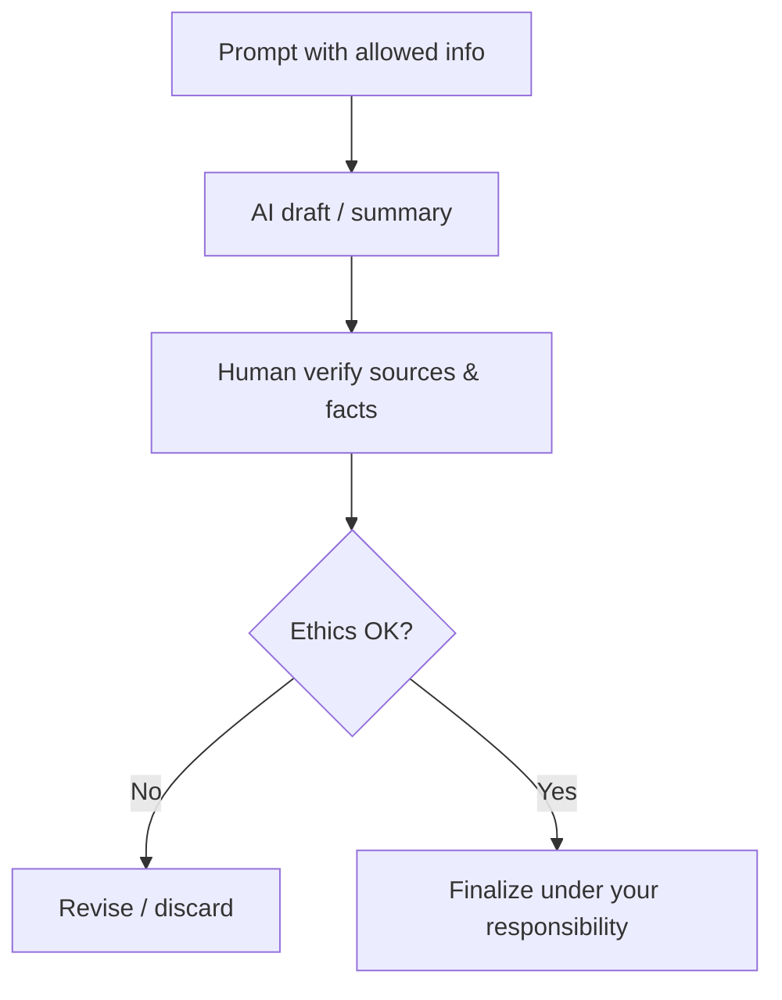

# Unit 5 — AI and Ethical Use of AI

**Course:** Computer Information (law students)  
**Hours / weight:** 6 hrs · 10%  
**Objectives:** 2, 7, 8, 9

## How to use
Study this unit, complete the matching lab(s), then attempt the unit Q&A bank.

**Objectives:** 2, 7, 8, 9

### Core ideas
AI can accelerate research and drafting, but **lawyers remain accountable**. Unit 5 trains **capable and responsible** use: tools + generative basics + judiciary/analytics awareness + ethics (privacy, bias, limits).

### Key definitions
- **Generative AI** — models that produce new text/media from prompts.
- **Legal analytics** — data-driven insights about cases, timelines, or patterns (tool-dependent).
- **Hallucination** — false output presented confidently (e.g., fake cases).
- **Bias** — skewed outcomes harming fairness.
- **Data protection / privacy** — rules and duties about personal/sensitive data.
- **Human-in-the-loop** — mandatory human review and ownership of final work.

### Explanation

#### AI tools for legal research & generative basics
Students may use approved tools to: brainstorm search terms, summarize *user-provided* text, outline issues, improve clarity of drafts.  
**Never** treat AI as an authority. Verify every legal proposition against authentic sources.

#### AI in judiciary & legal analytics (awareness)
Courts and labs globally experiment with transcription, translation, research support, and analytics. Adoption varies by jurisdiction; students should follow **local rules and college policy**.

#### AI-assisted drafting
Good pattern: you provide facts you are allowed to share → AI suggests structure/language → **you** verify law/facts → supervisor review → finalize.  
Bad pattern: paste confidential brief → accept citations blindly → submit.

#### Ethical issues, privacy, bias, responsible use, limitations
| Issue | Why it matters in law | Student practice |
|---|---|---|
| Confidentiality | Client secrets / academic integrity policies | No confidential pastes into public tools |
| Privacy & data protection | Personal data misuse risk | Minimize data; anonymize exercises |
| Bias | Unequal or stereotyped outputs | Cross-check sensitive conclusions |
| Accountability | Advocate/student owns the filing/submission | Sign only what you verified |
| Limitations | Hallucinations; outdated law; missing local context | Primary sources always win |
| Unauthorized practice concerns | AI is not a licensed lawyer | Don’t give “AI legal advice” as advice |

### Worked example — Human vs AI drafting comparison
Task: draft a practice demand letter scenario (fictional facts).  
1. Write a human outline.  
2. Generate an AI version from the same facts.  
3. Compare: tone, missing elements, incorrect legal leaps, citation quality.  
4. Write 300–400 words on risks + how you would supervise AI next time.

### Exam tip
Prepare short notes on **bias**, **privacy**, **hallucination**, **responsible use**, and **limitations of AI in law**. Use examples.

### Common pitfalls
- Citing AI-invented cases.  
- Assuming “the tool said so” is a defense.  
- Using AI to replace reading judgments.

### Key takeaways
- AI is an assistant, not an advocate.  
- Ethics is a skill outcome, not a disclaimer slide.  
- Verification and confidentiality define professional use.

### Self-check
1. **[Understand]** What is hallucination in generative AI?  
2. **[Apply]** Write a safe prompt policy for class exercises.  
3. **[Evaluate]** Judge whether uploading a real client affidavit to a public chatbot is acceptable—and why.
